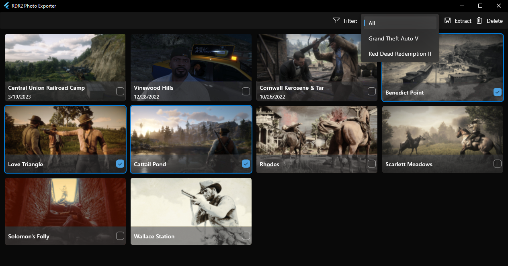

# RDR2 Photo Exporter

RDR2 Photo Exporter is, as its name implies, a program that allows you to export your Red Dead Redemption II (and Grand Theft Auto V) photos (stored on your PC) as JPEG images to any desired location.

## Features

- Browse your locally stored photos without having to launch the game
- Filter them by game (Red Dead Redemption II or Grand Theft Auto V), should you need it
- Select those you want to export and save them to JPEG without the extra bits and metadata (no need to save them to Social Club and then download them from the website!)
- Delete your unwanted photos (those saved to Social Club may be recreated automatically after you launch the game/sync your save folder again)
